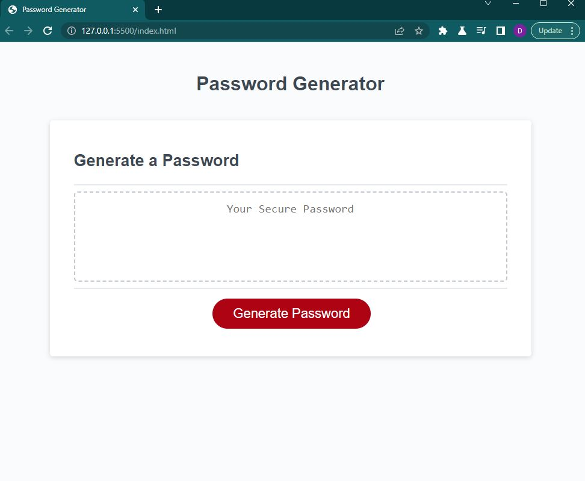

# password-generator

## Description
- To allow employees to generate random passwords based on criteria they have selected.
- To create a strong password that provides great security.

## Installation
1. Go to the following link: https://github.com/daniferru/password-generator.
2. Clone the repository.
3. Open th repository in Visual Studio Code.

## Usage
md

https://daniferru.github.io/password-generator/

## Tests
1. Navigate to https://daniferru.github.io/password-generator/
2. Confirm when clicking the generate button a prompt displays asking number of characters between 8-128.
3. After inputing a digit, confirm a prompt displays of wanting upper case, lower case, numerical, and special characters.
4. Once all prompts have finished, confirm a generated password displays in the textbox.